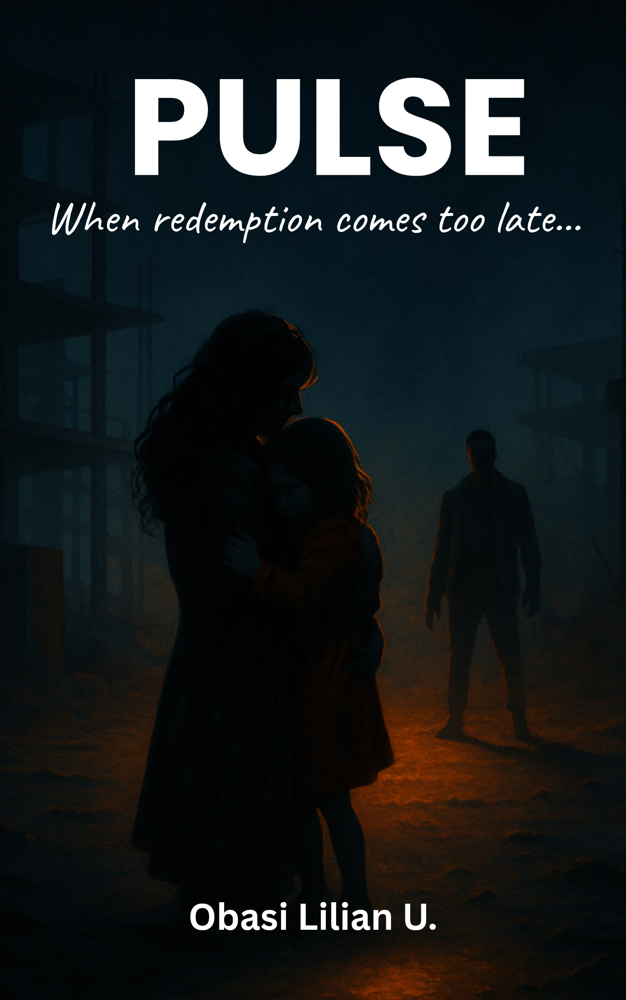

# FreeCodeCamp-Journey

Day 0- Setup
Today I created my GitHub account and my first repository. 

Goal:
To document my journey into Web development and build technical skills step by step.


Day 1 – HTML Basics

Today I started the Responsive Web Design section on freeCodeCamp.

What I learned:
- How to use heading tags
- How to create paragraphs using the tag
- How to insert images using the tag
- The importance of placing image files in the same folder as the HTML file

Practice:
- Created a basic HTML page with headings and paragraphs
- Successfully inserted and displayed an image in the browser preview

Example:


Reflection:
At first, some things didn’t work as expected, especially when previewing my file. Instead of giving up, I kept testing and switched to another editor (TrebEdit), which worked. Seeing the image display successfully felt amazing and made the learning feel real.


Day 2 – Adding Links with <a> and href

Today I learned how to create hyperlinks using the <a> (anchor) tag.

What I learned:
- How to use the href attribute to link to another website
- The basic structure of a hyperlink
- How clickable text can redirect users to external pages

Practice:
- Created a link that redirects to Facebook using an external URL

Example:

<a href="https://www.facebook.com">Visit Facebook</a>

Reflection:
It was interesting to see how one simple attribute (href) makes text clickable and connects my webpage to the outside world. Each new tag is helping me understand how websites are structured.


Day 3 – Combining Headings, Images and Links

Today I practiced combining multiple HTML elements in one page.

What I used:
- Headings 
- Paragraphs
- Images
- Links 

Example:

```html
<h1>Welcome BloomingStori</h1>

<p>Consider following us for more interesting stories.</p>

<h2>Read one of our stories</h2>



<h3>Read it today</h3>

<a href="https://a.co/d/01T5u9qG">
  Read Pulse:when redemption comes too late.</a>
```

Reflection:
Today felt more structured because I combined different tags together in one layout. I am beginning to understand how a simple webpage is built using basic elements.

Day 4 – Understanding the "link" Element

Today I learned about the "link" element in HTML.

What I learned:
- The link tag is placed inside the "head" section
- It is used to connect external resources to an HTML file
- It can link stylesheets (CSS), fonts, and icons
- The rel and href attributes are important when linking a CSS file

Reflection:
Today I understood how HTML connects to external files like CSS. Even though I haven’t fully learned CSS yet, I now know how to link a stylesheet to my HTML file. This helps me see how webpages are structured across multiple files.

Day 5-Independent Practice – Bean Cake (Akara) Page

Today I built my first independent HTML project without copying directly from the lesson.

Project: Bean Cake (Akara) Recipe Page

What I used:
- "!DOCTYPE html" structure
- "html", "head", and "body"
- "meta charset="UTF-8"
- Headings ("h1", "h2")
- Paragraphs and "strong" for emphasis
- Unordered list for ingredients
- Ordered list for instructions
- Image tag ("img")

Reflection:
This is my first independent assignment, and it feels great to build a complete webpage on my own. I’m beginning to think more about structure and organization, not just individual tags.


Day 6
Practice Project – Mini User Profile Page

In this project, I practiced using the &lt;div&gt; element along with class and id attributes.

Project Description:
I built a Mini User Profile Page containing multiple user cards. Each user card includes a name, short description, and action buttons.

Concepts Practiced:
- Using &lt;div&gt; to group related content
- Applying class for repeated styling patterns
- Using id for uniquely identifying elements
- Structuring multiple profile sections inside a container

What I Learned:
I learned the difference between class and id:
- Class is used for grouping elements that share similar styling.
- Id is used to uniquely identify a specific element.

This project helped me understand how to organize and label HTML elements properly in preparation for CSS styling.


Day 7
Creative Writing Portfolio – Version 1

Today,I built a personal creative writing portfolio entirely from memory without step-by-step guidance.

Project Overview
I created a structured HTML portfolio page showcasing my fiction writing work. The page includes:

- An About Me section  
- A Writing Profile section  
- Core Strengths  
- A Writing Samples section featuring multiple book entries  

Each book entry contains:
- Title  
- Cover image  
- Author and genre details  
- Video preview  
- External link to read the work  

Concepts Applied
- Proper HTML document structure (&lt;!DOCTYPE&gt; , &lt;html&gt; , &lt;head&gt; , &lt;body&gt;)
- Meta description for SEO
- Semantic organization using &lt;section&gt;
- Grouping content using &lt;div&gt;
- Use of `class` for repeated structures (book cards)
- Use of `id` for unique elements
- Anchor tags for internal and external navigation
- Embedding media with &lt;img&gt; and &lt;video&gt;

What This Project Represents
This project demonstrates my ability to:
- Build a complete structured webpage from memory
- Organize complex content logically
- Combine text, media, and links into a cohesive layout
- Work independently without guided instructions

This marks a transition from guided practice to independent development.

